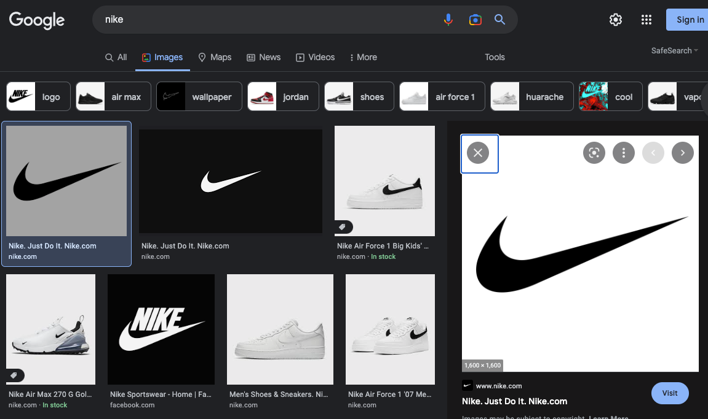
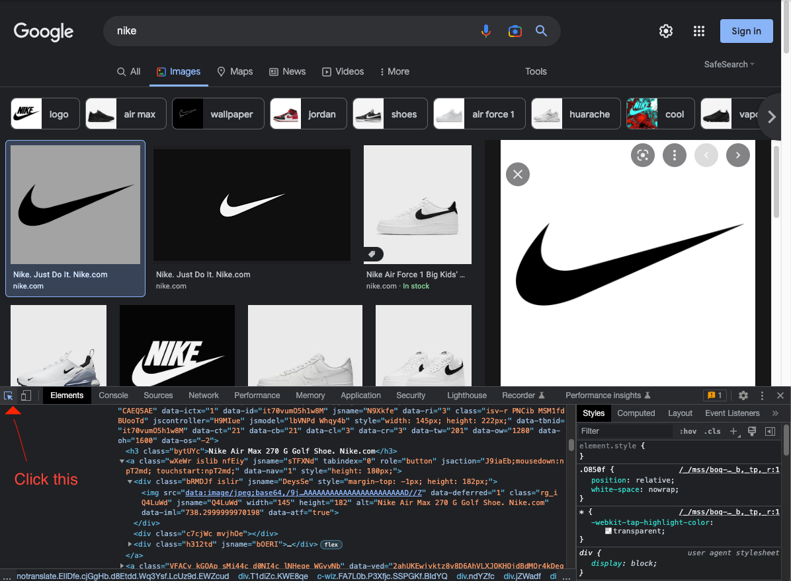
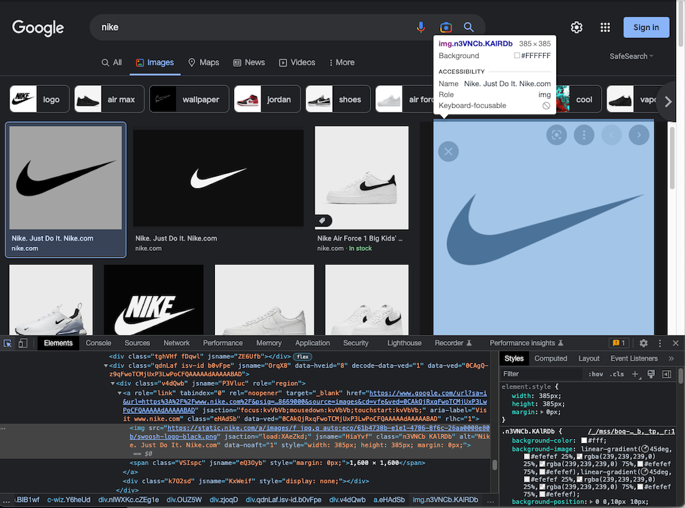
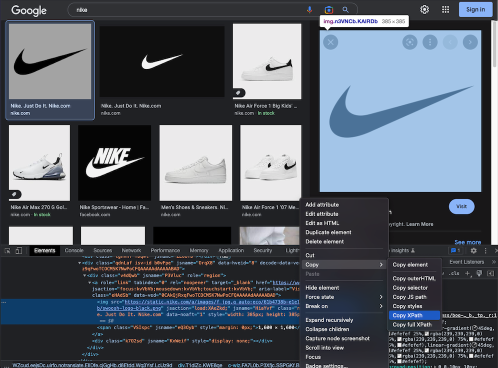

# Google Full size image crawler

### Development Environment
- web : Chrome
- OS : MAC
- IDE : Pycharm

### How to use crawler
1. Download suitable chrome driver. </p>Follow this [link](https://chromedriver.chromium.org/downloads).
2. You should specify PATH in `webdriver.Chrome()`
   ```python
    PATH="./chromedriver"
    driver = webdriver.Chrome(executable_path=PATH)
    ```
3. You should specify full size image xpath in chorme.
   1. Do search
   
   2. Go to inspect, and click right mouse icon.
   
   3. touch full size image, and go to inspect
   
   4. copy xpath
   

4. replace copied xpath with xpath param.
   ```python
   imgUrl = driver.find_element(By.XPATH,"//*[@id='Sva75c']/div/div/div[3]/div[2]/c-wiz/div/div[1]/div[1]/div[3]/div/a/img").get_attribute('src')
   ```
5. Run the code!.

### reference
- [link](https://velog.io/@ishikawakanata/Selenium%EC%9D%84-%EC%9D%B4%EC%9A%A9%ED%95%B4-%EA%B5%AC%EA%B8%80-%EC%9D%B4%EB%AF%B8%EC%A7%80-%EC%9B%90%EB%B3%B8%EC%9C%BC%EB%A1%9C-%ED%81%AC%EB%A1%A4%EB%A7%81%ED%95%98%EA%B8%B0) : written in korean
- I fixed bug above code which doesn't run with latest selenium package.
